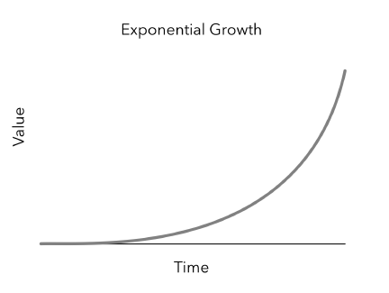

優化的學習方式能帶來更高的效益（leverage），如果我們要增進自我能力，「成長型思維」是不可或缺的因素。

## 實踐成長型思維

固定型思維（Fixed mindset）的人認爲「一個人的成敗來自於先天上的條件（例如：天賦、才智），失敗就代表我們不夠聰明，或是能力不足」。但是對成長型思維（Growth mindset）的人而言，「透過努力，我們能夠改變自己的智力、能力」。就算一開始在某個領域只是一個初學者，但透過不斷地挑戰、從失敗中學習，終究會帶來豐碩的成果。

要思考如何**撰寫我們的故事**，而不是讓別人來定義我們，也不是我們的學歷、工作經歷。自身的價值，來自於我們如何定義它。

> 英雄不怕出身低

勇於嘗試新事物、無論是溝通技巧、新的網路技術，或是其他技能，不要在責備自己的失敗、無法控制的外部因素上蹉跎。在學習過程中，找到對自己更有效率地學習方式，並從中獲取寶貴的經驗。

## 學習效率的投資

我們在學校學到關於「複利」的概念：

### 複利的特性

1. 指數型的成長
2. 越早投入，成長的速度越快（這也是爲何投資專家都建議越早投入 [401k 退休儲蓄計劃](<https://zh.wikipedia.org/zh-tw/401(k)退休福利計畫>)越好，因爲你有更多的時間**滾利**）
3. 利息的差異對後續影響甚鉅，而且也是非線性的

Edmond 將學習比喻成複利：

### 學習就像是複利

#### 1.學習過程也是指數型成長的

當我們學得越多，我們的背景知識越雄厚，因此學習起來就更加快速。

假設我們看第一本英文書，每讀一頁需要查 10 個單字；那麼當我們很辛苦看完這本書之後，或許在讀第二本英文書時，每頁只有 1 個單字沒學過。

#### 2. 越早學習，就能加速學習速度（根據第一點）

例如：第一份好的工作，能夠讓我們找到更好的工作，並影響往後的職涯發展

#### 3. 如同滾利，學習量對對長期發展來説很大

複利的曲線如下：

可以回想一下，我們是不是時常花時間在做毫無挑戰、無趣、沒意義的事情上？這其實對學習的效率並不好，我們失去了**增進學習效率**及**未來成長**的機會。[^1]

[^1]: 編按：但現實面而言，有時那些無意義的事也許是主管的命令，非做不可

## 尋找「成長導向」的工作環境

每天工作的時間平均有 8 小時，也就是一天有 1/3 的時間是在工作上，如果說我們要提升效益（leverage），最好的「著力點」（leverage point）就是選擇一個**以成長為導向的工作環境**，因為我們都知道，環境對我們的影響甚鉅。

在此，Edmond 以六個因素分別探討如何尋找一個「以成長為導向」的工作環境：

### 六個因素

#### 1.快速成長的公司

當 [Sheryl Sandberg](https://zh.wikipedia.org/zh-tw/雪莉·桑德伯格) 猶豫要不要加入 Google 的時候[^2]，Google 的 CEO [Eric Schmidt](https://zh.wikipedia.org/zh-tw/埃里克·施密特) 給了一個很有價值的建議：

> 如果你得到一張太空船的搭乘券，不要問哪一個位子，跳上船就對了。[^3]

_~~謎：老司機要發車了，抓穩囉～~~_

快速成長的團隊及公司提供更多的資源，也吸引更多的人才，進而組成更強大的團隊。

[^2]: 編按：若拿到 Google 的 offer 有誰會猶豫要不要去？😂
[^3]: "If you’re offered a seat on a rocket ship, you don’t ask what seat. You just get on."

#### 2.員工的訓練計畫

良好、完善的訓練計畫代表公司重視新進員工。以 Google 為例，他們投資大量資源在「engEDU 計畫」。這個課程包含一系列的講座、研討會、設計文件、開發指南文件（Programming guides）等，可以幫助工程師們及管理階層。Facebook 也有一個為期六週、稱作「Bootcamp」的訓練計畫，讓新人可以學習熟悉公司的工具以及開發流程。

#### 3.開放思維

以 [SCRUM 的思維](https://zh.wikipedia.org/zh-tw/Scrum)（敏捷開發）來看，我們不是在一開始就希望做到完美，而是循序漸進地，透過持續修正、不斷改進來接近目標。[^4]

有時候，團隊成員會因意見向左，互相挑戰對方，而這時保持開放的心態去討論，接納他人的回饋，才能成為未來進步的墊腳石。而勇於發問、不怕問笨問題的文化，才能知道自己不足的地方，並虛心接受他人的建議。對於失敗的地方，我們不是要抓戰犯、檢討別人，而是分析原因，以防下次再發生。

[^4]: 在後面的章節也會提到關於敏捷的思維

#### 4.工作的步調

快速的工作步調、快速的迭代可以增進學習的速度。小公司比較沒有官僚的文化，所以不會像大型公司有繁複的審核流程，可以很容易地做一些實驗性的發想。但最重要的，是找到適合自己工作步調的地方。

#### 5.團隊的組成

身邊若是身邊有聰明、充滿創造力的同事，就能使我們成長。或許有些人還能成為我們的導師。或許你/妳天賦異稟、才華洋溢或自學力強。但工程師是講求**團隊精神**的工作（相信很多職業都是），相互的交流會激發出更多創意的火花，比閉門造車好多了。除了有助於未來職涯的發展外，也能提升我們的工作幸福指數（work happiness），誰都不想跟難相處的人共事，對吧？

#### 6.自治

擁有調配、規劃自己時間的自由，才有能力去學習，因為我們有掌控自己時間的權利。

在小公司擁有更多自己的選擇，能做更多不同的事。Edmond 舉例，在 Quora 工作的三年間，他有機會做了各式各樣的事，面對不同的挑戰。身為一位工程師，他開發實驗性的工具、即時分析框架（Real-time analytics frameworks）、infrastructure、網路攻擊偵測（spam detection）、手機開發等。另一方面，也做了很多跟工程無關的事：面試官的訓練、製作新人訓練教材、打造導師制度（mentoring program）、還有執行產學合作的實習計畫 ⋯⋯ 等等。在比較小規模的公司，才能做到如此廣泛的事情。也正因為如此，他才能從中學到很多不同的經驗。

### 關於這節的小小心得

看完這節的當下，我不禁思索：「主管指定要新人看這本書真的好嗎？會不會看了這一節之後，評估後覺得公司沒有使人成長的環境就閃人了？」 😂

但後來想想，其實不盡然。很多公司都是人來來去去的，本來就是蠻正常的。

雖然這節主要在講的是關於工作環境對於學習的重要性，但我覺得另一個更重要的點是，「個人的學習及成長」獲利的並**不僅限於個人，對於公司也是正面的影響**，就如前面[第五點](#5團隊的組成)的概念：周遭的人使我們成長；而我們個人的成長，就是**整個團隊成長**；團隊的成長，即是公司的成長。公司的成長會提升價值，進而吸引更多的人才，這是一個**正循環**。

## 花點時間在開發新技能

隨著專案的進行，待辦事項會不斷地增加，就算我們想要快速地將那些代辦事項給**做完**，但那個清單並不會因此而減少。我們花了很多時間在執行各種任務，卻沒有時間發展、學習新的技能，而這些才是能夠增進我們做事效率的技能。

**20% 時間（20% time）** 是 Google 發起的一個概念[^5]。當工程師每週用一天的時間（也就是一週工作時數 40hr x 20% = 8hr）來做個人專案（side project），就可以為公司帶來成長。

或許這個想法頗有爭議，因為就時間上來看，工程師一週的五個工作天裡，只有四天的時間是有為公司產出。但以 Google 的例子，如果沒有這一天的投資在學習上，就不會有 Gmail、Google News 及 AdSense 這些產品的出現，而這些產品也是目前 Google 核心的產品線之一。

那我們要如何運用這 20% 的時間呢？我們可以在已經了解的技術領域中，做更深入地學習。或是學習其他不同的領域。微軟 Windows 部門的前主管 [Steven Sinofsky](https://en.wikipedia.org/wiki/Steven_Sinofsky) 曾提倡「臨近訓練（Adjacent Discipline）」想法，主要描述我們學習的内容，若是同一個領域的知識，學習的效果將會相輔相成。

[^5]: 3M 的 **15% 法則**（15% Rule）概念早在 1948 年提出。Google 則是在 2004 年提出 20% 時間。[參考維基百科](https://en.wikipedia.org/wiki/20%25_Project)（感謝 Souch.H 補充 🙏 ）

### 10 個學習上的建議

1. 向公司内優秀工程師學習他們在程式裡的抽象化概念
2. 寫更多的程式碼，熟能生巧，透過做中學
3. 多參加讀書會、技術研討會，或是看一些教學資源
4. 精通我們主要使用的程式語言，深入探討深層的概念，熟悉核心語法。另外，確保其中一個我們會的語言是**脚本語言**（scripting language），因爲它能夠讓我們快速開始，無需編譯
5. 將我們的程式碼給最嚴格的人做 code review，降低標準對程式碼品質的進步無益，也要避免寫了很炫炮的程式碼，但無法派上用場
6. 參加想要精進的課程：例如：公司的工作坊、附近大學、或線上課程（例如：[Coursera](https://www.coursera.org)、[edX](https://www.edx.org)、[Udemy](https://www.udemy.com)、[Udacity](https://www.udacity.com)）
7. 參與一些有興趣的專案的討論
8. 參與不同類型的專案。如果我們發現自己不斷用同樣的方式做重複的事情，那就是來嘗試新技術的時候。
9. 確保我們所屬的團隊裡有資深工程師可以作爲學習對象
10. 勇於研讀陌生的程式碼，不要害怕去理解它。_**Get hands dirty!**_ 🤘

## 終身學習

我們都知道終身學習的重要性。在工作以外的時間裡，提供 10 個切入點來養成學習的習慣，這些不一定是要跟工作的領域有關係，也可以是培養一些興趣。

### 養成學習習慣的 10 個方向

#### 學習新的程式語言或是框架

軟體領域變化、演進快速，所以要養成持續學習的習慣，這也是它有趣的地方，因爲學習新技術可以激發新的思維，進而優化我們的做事方式

#### 投資高需求技能

觀察最近的趨勢，看哪些是目前非常短缺的技能，學習那些技能，也能為自己的履歷充值

#### 養成閲讀的習慣

[Bill Gates](https://zh.wikipedia.org/zh-tw/比尔·盖茨) 花很多時間在閱讀上，尤其是非文學類的書籍。雖然聽起來很八股，但閲讀一直是很多名人、偉人建議培養的好習慣，閲讀能夠增進我們的視野、了解世界的運作模式。可能一開始會覺得閱讀速度很慢，但是如同前面談到的[複利特性](#1學習過程也是指數型成長的)，讀越多書，閱讀速度亦會隨之增加。

#### 參與討論群組、讀書會

跟相同興趣或是研究相同主題的人們相互討論，可以激勵彼此

#### 參加講座、研討會、線下聚會

這些場所可以很容易得知目前該領域的趨勢，也可以藉機會認識相同興趣的人們，或是適合的職缺

#### 建立、鞏固人脈

認識的人越多，我們的機會就越多。作家 [Richard Wiseman](https://en.wikipedia.org/wiki/Richard_Wiseman) 在他的著作 The Luck Factor[^6] 中提到：「幸運的人會在日常生活中不斷認識很多人，藉此得到更多的機運。他們認識越多人，就有創造更大的機運為人生帶來正面的影響。」[^7]

[^6]: 中文版書名：[幸運人生的四大心理學法則：提升直覺、擺脫厄運，最科學的 30 天運氣大改造](https://www.books.com.tw/products/E050041324)
[^7]: "Lucky people dramatically increase the possibility of a lucky chance encounter by meeting a large number of people in their daily lives. The more people they meet, the greater opportunity they have of running into someone who could have a positive effect on their lives"

#### 追蹤一些講師的部落格

善用網路資源去學習他人的經驗

#### 寫教學文章

「教學相長」，當我們在寫教學文章的時候，我們需要把我們已經學會的觀念轉化成文字，而且避免寫出錯誤的資訊，也迫使我們必須檢查自己的觀念是否正確。除了撰寫教學文章之外，在研討會上演講也是一樣的。[^8]

[^8]: 編按：能夠 live coding 才是真正厲害的强者！

#### 動手打造個人專案（side project）

做個人專案，就算跟程式無關也無妨，有時候做與擅長領域迥異的事，例如：繪畫、寫作等，反而可以幫助我們成爲更好的工程師。

#### 追求所愛

比起一些被動娛樂（例如：看電視），將時間投資在有意義的興趣上，不但能培養新技能，也可以增進心理健康。

## 結語

本章不斷帶出學習的重要性，也強調自我提升（self-improvement）所帶來正面的影響，無論是在職涯、或是人生成就方面。Edmond 提供了他個人的一些意見，雖然不盡然適用所有人，但是其宗旨卻不變，尋找屬於自己的學習方式及目標，打造一個更好的自己。

很多面試官會問面試者這個問題：「五年後的你，會如何看待現在的你？」[^9]

保持成長型思維，隨時做好準備，才能迎接隨時會來臨的機運。

[^9]: "Where do you see yourself five years from now?"
