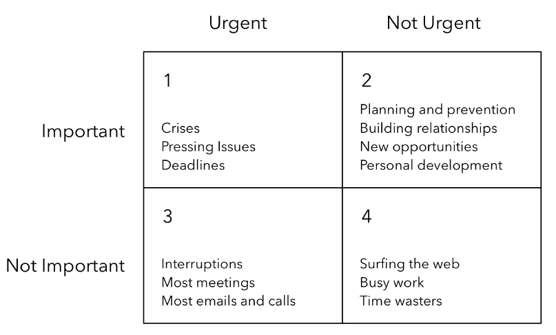

優先度排程（Prioritization）是一門學問，就跟其他的技能一樣需要不斷地練習，高效工程師不斷地再持續精進這件事。

建立一個好的待辦事項清單可以確保不會遺漏掉任何事情。首先依優先度排定一個必須做的事項清單。

作家 David Allen [^1] 在他的著作「Getting Things Done」[^2]中提到：「人類的大腦擅長的是**資訊處理**，而**非資訊儲存**」[^3]。所以比較好的方式就是將需要記憶的事情，用其他方式記錄下來，而不是依靠大腦的記憶。

[^1]: 中文譯名：[大衛．艾倫](<https://en.wikipedia.org/wiki/David_Allen_(author)>)
[^2]: 中文書名 - [搞定！：工作效率大師教你:事情再多照樣做好的搞定 5 步驟](https://www.books.com.tw/products/0010731198)
[^3]: Human brain is optimized for processing and not for storage.

## 代辦清單的兩個元素

待辦清單必須有以下兩個重要的元素：

1. 有固定格式的陳述
2. 放在容易取得的地方

我們可以很快地從清單中看出哪些是目前可以完成的，或是在某些空擋，一瞥清單就可以很快地找到能夠做些什麽，而不是費勁心思努力回想。

## 代辦清單的形式

待辦清單可以是很多種的形式，它可以是一本可隨身攜帶的筆記本、任務管理軟體（電腦桌面程式或是手機 APP）、同步到雲端的文字檔（可以同時在電腦及手機上檢視、編輯）。而怎樣的形式其實不是重點，最重要的是在於我們將腦海中的想法抽取出來，集中在一個地方存起來，並在想到的時候隨時隨地可以取得這些資訊。

## 專注在有產值的事

做有實際影響力的事，完成任務的「質」大於「量」。每天回顧當天所做的事，是否對增進開發進度、減少寫出 bug 的機會 ⋯⋯ 等。

當我們拿出實際成果，就沒有人會抱怨拒絕出席會議、很慢回信、或不處理一些小 bug。當我們把重要的事情做好，瑣碎的雜事就變得不這麼重要了。在生活中也是如此：若我們為了下一趟旅行開始存錢，與其每天省下一杯 3 美元的星巴克拿鐵，花時間研究如何買廉價航空的機票反而是比較有效率的作法。

不要試著做完所有的事情（因爲那是不可能的，我們的時間有限），專注重要的事、專注在有價值產出的事。[^4]

[^4]: 「[少，但是更好](https://www.books.com.tw/products/0010802460)」一書也提到相同的概念：「排除多數『瑣事』，專注少數『要事』」（Distinguishes the **vital few** from the **trivial many**）

## 任務類型的四象限

作家 Stephen Covey [^5] 認爲，我們不該將「重要」跟「緊急」畫上等號。Covey 將任務分成四大類，分成兩個因素：「重要」（Important）或「不重要」（Not Important）、「緊急」（Urgent）或「不緊急」（Not Urgent）區分，分成四個象限，如下圖：

以**長遠的視野**來看，**第二象限**的事項才是最重要的投資，也是影響力最大的。但通常這區的事項沒有確切的截止日期，花時間投入也不會有立竿見影的成效，而且在短期的時程看來，有可能看起來是在浪費時間（因爲看不出任何顯著的成效，但卻花了很多時間在上面），所以我們通常很容易忽略這一象限。

從我們的待辦事項中，分辨哪些屬於第二象限（不緊急但重要）的任務，並將歸類於第三象限（緊急但不重要）及第四象限（不緊急亦不重要）的優先度排到最後。

此外，要特別注意第一象限（緊急且重要）的事項，因爲它們看起來是必須優先處理的任務。雖然第二象限最重要，但我們也不能放著緊急的事不管（例如：production 上的重大 bug）。Edmond 提到：「緊急的事像是：重大的 bug、迫在眉睫的截止日 ⋯⋯ 等等，這些事的根本原因有可能來自於缺乏執行某些第二象限任務，例如：有重大的 bug 可能源自於不夠高的測試覆蓋率；時常發生開發時間不足，可能是因為期程的規劃不周全，或是時間預估有誤差 ⋯⋯ 等等。所以在第二象限投資更多時間，也有助於減少第一象限需要做的事情。」[^6]

[^5]:
    [史蒂芬‧柯維](https://zh.wikipedia.org/zh-tw/史蒂芬·柯维)，
    其最有名的著作為：「[與成功有約：高效能人士的七個習慣](https://www.books.com.tw/products/0010874292?gclid=Cj0KCQjw38-DBhDpARIsADJ3kjm7otLYTpjqlKHQlRsDTqFiDbYuym6ThF23SkaW-AIhcEe0jfrazCwaAsHmEALw_wcB)」

[^6]: 第二象限並非**絕對**比第一象限重要，而要**視當下情況而定**。我們總不能放著 production 的重大 bug 不修，然後去第二象限的事。（感謝 Raistlin.C 補充 🙏 ）

## 捍衛開發時間[^7]

比起其他專業人員，工程師需要藉**長期且連續的時間**來提高生產力。[^8]

在連續的時間裡維持心理學家 Mihály Csíkszentmihályi[^9] 所提倡的[「心流」（flow）](https://zh.wikipedia.org/zh-tw/心流理論)，就能夠提高生產力。這種狀態是「一個不需要刻意維持專注、忘卻時間流逝、無我的狀態」[^10]。心流需要高度的專注力，打岔會中斷心流。

美國著名程式設計師兼風險投資家 Paul Graham[^11] 在他的論文「創造者的日程、管理者的日程」[^12]提到，管理者（管理階層）的時程規劃通常以「小時」為單位，但是對創造者（執行團隊，例如：軟體工程師、作家等）而言，比較適合以至少「半天」爲單位去執行他們的任務。微軟的一個研究[^13]也顯示：員工若被信件、訊息回覆打斷工作之後，平均需要花 10 至 15 分鐘的時間拉回注意力到原本正專心做的事。[^14]

盡可能規劃工作排程，為自己保留完整且連續的開發時間，排除不必要的會議及關閉不必要的聊天訊息通知。[^15]

[^7]: 原文標題：Protect Your Maker's Schedule
[^8]: 雖然 Edmond 這麼說，但我認為不限工程師。我也有認識的設計師希望自己的工作時間不要被太多會議打斷。
[^9]:
    美國心理學家[米哈里．契克森](https://zh.wikipedia.org/zh-tw/米哈里·契克森)。
    關於心流，可參考他 2004 年於 TED 的演講：[談「心流」](https://www.ted.com/talks/mihaly_csikszentmihalyi_flow_the_secret_to_happiness?language=zh-TW)

[^10]: A state of effortless concentration so deep that they lose their sense of time, of themselves, of their problems.
[^11]: 中文譯名：[保羅．格雷厄姆](https://zh.wikipedia.org/zh-tw/保罗·格雷厄姆)
[^12]: [Maker's Schedule, Manager's Schedule](http://www.paulgraham.com/makersschedule.html)
[^13]: [Disruption and Recovery of Computing Tasks: Field Study, Analysis, and Directions](http://erichorvitz.com/CHI_2007_Iqbal_Horvitz.pdf)
[^14]: Employees take an average of 10 to 15 minutes to return to focused activity after handling email and instant messaging interruptions.
[^15]: 編按：但我相信很多人跟我一樣，有些會議時間是我們沒有辦法決定的@@

## 避免同時進行太多的事項[^16]

避免過多的多工，因爲大腦無法同時處理太多的事情，同時進行太多的事情，反而會降低專注力、甚至影響生產力。

「Personal Kanban」[^17]一書中提到，我們必須要限制進行中任務[^18]的數量。作者 Barry 及 Benson 提到：「我們越接近大腦所能處理資訊的承載極限，就越容易累積心理壓力，也會影響效率。」[^19]，「給大腦的工作量**線性**增加，但出錯的機率卻是**指數**增加。」[^20]

人類的大腦雖然可以同時處理很多事情，但是若我們講求品質、效率及生產力，那就要盡量避免多工處理。想像它是一個單執行緒的處理器，將不必要的事情先排除吧！

[^16]: 原文標題：Limit the Amount of Work in Progress
[^17]: [Amazon.co.jp: Personal Kanban: Mapping Work | Navigating Life (English Edition) 電子書籍: Barry, Tonianne DeMaria, Jim Benson: Kindle ストア](https://www.amazon.co.jp/Personal-Kanban-Mapping-Navigating-English-ebook/dp/B004R1Q642/ref=sr_1_1?__mk_ja_JP=%E3%82%AB%E3%82%BF%E3%82%AB%E3%83%8A&dchild=1&keywords=personal+kanban&qid=1618455055&s=digital-text&sr=1-1)
[^18]: Work in Progress
[^19]: The closer you get to reach- ing your capacity, the more the stress taxes your brain’s resources and impacts your performance.
[^20]: Increasing work linearly increases the likelihood of failure exponentially.

## 解決拖延症

心理學家 Heidi Halvorson [^21] 在她的著作「Succeed」[^22]提出一個幫助我們改善拖延症問題的方法，稱爲「if-then 計劃」（if-then plan）。我們在做事前，先執行這個計劃，例如：「**若**三點會議結束了，我**就**來查這個預期很花時間的 bug」、「**若**在晚餐後，我**就**來看一則關於安卓開發的演講」。

以程式的術語來説，就是以一個「條件」（例如某個時間點）來作爲「觸發」一個事件（我們規劃要執行的任務），只要有了明確的觸發條件，就能減少拖延的發生。[^23]

「if-then 計劃」讓我們在創造者日程[^24]中，很快決定在片段的時間裡，能夠做些什麽事。試問自己：「在計畫事項開始前，**若**有 20 分鐘的空擋，我**就**要做 OOO」。試著列出一個待辦事項清單，裡面的事項是可以用零碎時間完成的，並利用空擋時間完成它們吧！

[^21]: 中文譯名：海蒂．格蘭特．海佛森
[^22]: 中文書名：[實現：達成目標的心智科學](https://www.books.com.tw/products/0010876282?loc=P_0004_027)
[^23]: 掌握一個習慣的觸發條件，就能輕鬆改變習慣。——[「為什麼我們這樣生活，那樣工作？」](https://www.books.com.tw/products/0010560033)
[^24]: Maker's Schedule

## 定期檢視優先順序[^25]

定期瀏覽代辦事項，將目前高優先度的往前面排，做~~滾動式~~動態調整。[^26]

優化工作流程，就如前面所描述的，很多人提出不同的見解及方式，世上沒有所謂的最佳解。適合的方法也因人而異，唯有找到最適合自己的方式、甚至混合各種做法（hybrid）、打造自己的系統（build up your system），才能真正提升生產力。

[^25]: 原文標題：Make a Routine of Prioritization
[^26]: [[問卦] 滾動式到底是什麼啊](https://www.ptt.cc/bbs/Gossiping/M.1621406360.A.E77.html)

## 重點回顧

- 列出待辦事項清單：切記大腦是**做決策的中樞**，不是儲存資料的硬碟
- 做有產值的事：不要想著**完成所有事**
- 花時間投資在「重要但非緊急」的事：一切都是爲了長遠的計劃
- 減少任務切換的次數：這都是爲了減少切換工作模式時耗費的精神力、也減少專注力的損耗
- 用「if-then 計劃」對抗拖延症
- 養成定期檢查優先順序的習慣

## 結語

本章的主題雖然是圍繞著「代辦事項清單」，但是也提到很多概念，又有很多書籍的節錄、文獻的參考及名人的語錄，為了不讓本文變得過於冗長，讓讀者偏離了主題，所以就以註腳的形式放在最後，希望不會為各位帶來閱讀上的困擾。

## 延伸閲讀

- [[譯]Maker's schedule, Manager's schedule · TomoHung](https://tomohung.github.io/2015/01/12/yi-makers-schedule-managers-schedule/)（繁中翻譯）
- [Maker's Schedule, Manager's Schedule - 知乎](https://zhuanlan.zhihu.com/p/29276148)
- [我不是故意裝忙，只想好好工作！「勿擾模式」工具能奪回時間主控權嗎？ | by JH | Star Rocket | Mar, 2021 | Medium](https://medium.com/starrocket/do-not-disturb-software-in-workplace-a469f2cba157)
- [腦海裡的演員們（Your Brain at Work） - An Explorer](https://limboy.me/2018/03/10/your-brain-at-work/)
